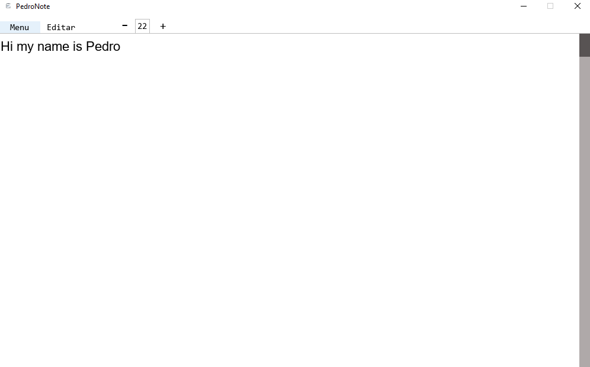

# Pygame Notepad

A simple notepad application built with **Pygame**. This project is currently under active development.

## 📸 Preview

## 🚀 Features
- **File Management:** Open and read both `.txt` and `.pdf` files.
- **Exporting:** Download your notes in `.txt` or `.pdf` formats.
- **Custom UI:** A unique interface powered by the Pygame engine.

## 🛠️ Status
This project is **Work in Progress (WIP)**.